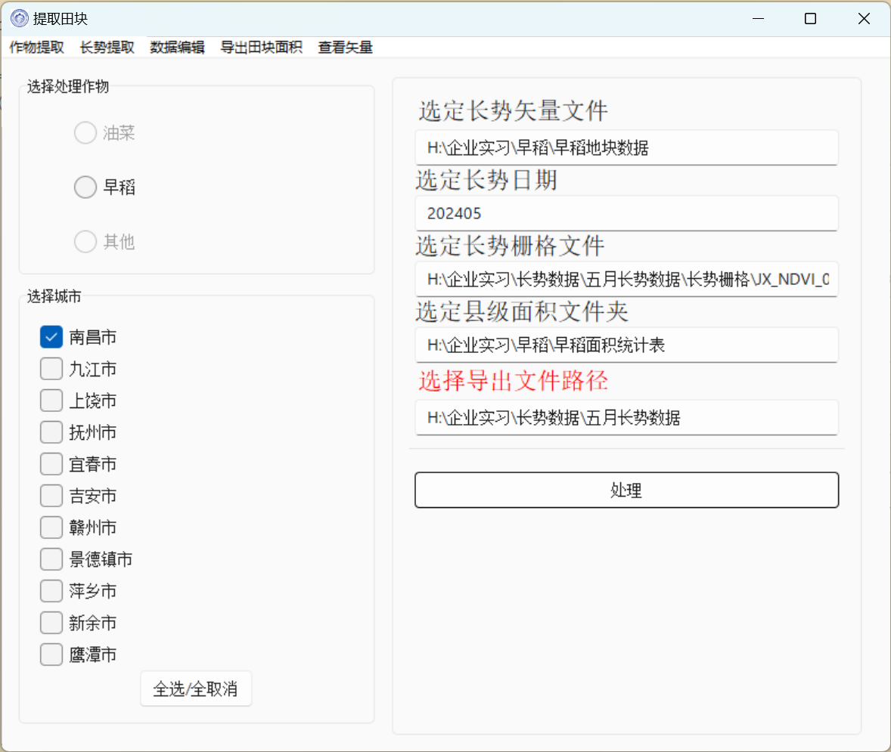

# 一个基于遥感数据确定田块内作物的ArcGIS二次开发软件

## 1.使用tkinter+arcpy，解放了生产力

​	

#### 使用前提：

###### 	1）更改asset\Global.py中两处地方。

```
CUN_SHP = r"F:\企业实习\早稻\长势数据提交\江西村边界.shp"
jiangxi_cities: list[str] = ["南昌市", "九江市", "上饶市", "抚州市", "宜春市", "吉安市", "赣州市", "景德镇市", "萍乡市", "新余市", "鹰潭市"]
```

###### 	2）若是在arcgis pro的环境下，需要下载geopandas，否则将”查看数据\查看矢量详情.py“内的geopandas相关给注释掉且不能使用查看矢量的功能。

###### 	3）引入的包：

```
\ArcGIS\Pro\Resources\ArcPy
\ArcGIS\Pro\bin\Python\envs\arcgispro-py3\python39.zip
\ArcGIS\Pro\bin\Python\envs\arcgispro-py3\DLLs
\ArcGIS\Pro\bin\Python\envs\arcgispro-py3\lib
\ArcGIS\Pro\bin\Python\envs\arcgispro-py3
\Python\Python39\site-packages
\Python\Python39\site-packages\win32
\Python\Python39\site-packages\win32\lib
\Python\Python39\site-packages\Pythonwin
\ArcGIS\Pro\bin\Python\envs\arcgispro-py3\lib\site-packages
\ArcGIS\Pro\bin
\ArcGIS\Pro\Resources\ArcToolbox\Scripts
\ArcGIS\Pro\bin\Python\envs\arcgispro-py3\lib\site-packages\future-0.18.2-py3.9.egg
\ArcGIS\Pro\bin\Python\envs\arcgispro-py3\lib\site-packages\pytz-2022.1-py3.9.egg
\ArcGIS\Pro\bin\Python\envs\arcgispro-py3\lib\site-packages\pywin32security
\ArcGIS\Pro\bin\Python\envs\arcgispro-py3\lib\site-packages\sympy-1.9-py3.9.egg
```



